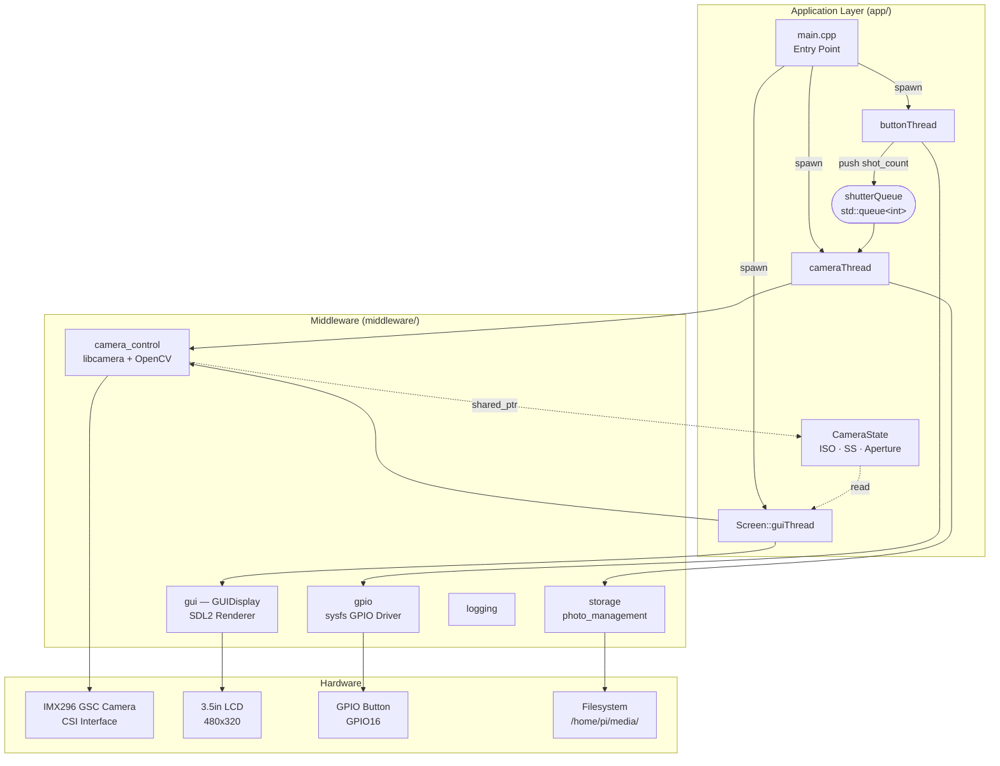
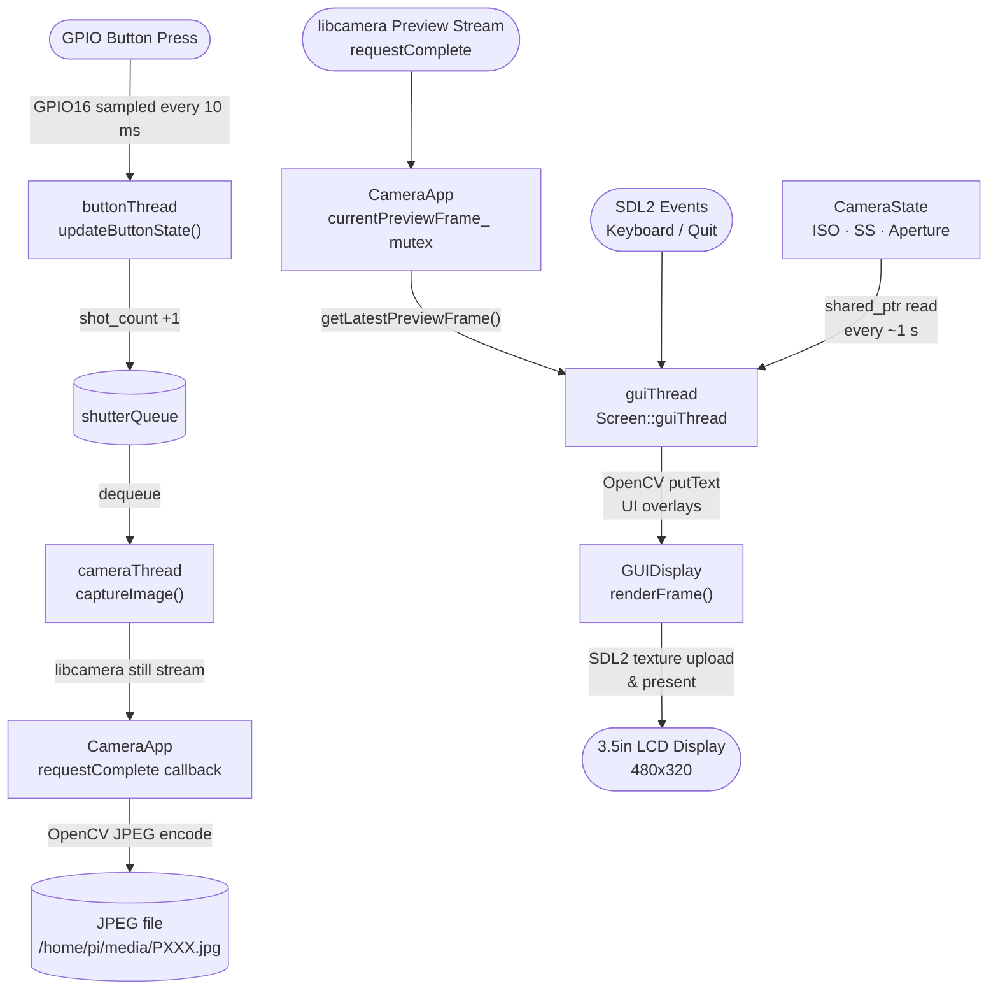

# Rudo Camera Project

**Rudo Camera** is a modular, multi-threaded camera application designed for the Raspberry Pi Compute Module 4 (CM4) with a high-quality GSC IMX296 sensor and a 3.5” 480x320 touchscreen. It enables image and video capture, real-time camera previews, and a user-friendly UI with support for buttons or touch input.

The project is optimized for embedded performance and structured for scalability.

---

## Features

- **Multi-Threaded Design**  
  - Separate threads for camera capture, button/touch input, and UI rendering.  
  - Ensures smooth performance and responsiveness.

- **Camera Control**  
  - Capture JPEG images using OpenCV with libcamera backend.  
  - Support for dynamic camera settings (ISO, shutter speed).  
  - Save captured images to disk with automatic naming.

- **User Interface (SDL2-based)**  
  - Live video preview scaled to 480x320 screen.  
  - UI overlays for ISO and shutter speed values.  
  - On-screen status (e.g., "● REC") for video recording.

- **Button & Touch Input**  
  - Support for physical buttons (GPIO) or touchscreen events.  
  - Toggle image capture or video recording easily.

- **Logging**  
  - Debug, status, and error logs for easier debugging and monitoring.

- **Cross & Native Compilation**  
  - Buildable natively on Raspberry Pi or cross-compiled from a Linux PC.

---

## Software Architecture

The application is structured in three layers:

```
┌─────────────────────────────────────────────────────────────┐
│                   Application Layer  (app/)                  │
│                                                              │
│   main.cpp ──spawn──► buttonThread ──► shutterQueue          │
│                  └──► cameraThread ◄── shutterQueue          │
│                  └──► guiThread (Screen)                     │
│                                                              │
│   Shared: CameraState (ISO · ShutterSpeed · Aperture)        │
└─────────────────────────────────────────────────────────────┘
┌─────────────────────────────────────────────────────────────┐
│                  Middleware Layer  (middleware/)              │
│                                                              │
│   camera_control  │  gui (GUIDisplay)  │  gpio              │
│   libcamera+OpenCV│  SDL2 Renderer     │  sysfs driver      │
│   ─────────────── │  ─────────────     │  ────────          │
│   storage         │  logging                                 │
│   photo_management│  debug / status / error                  │
└─────────────────────────────────────────────────────────────┘
┌─────────────────────────────────────────────────────────────┐
│                      Hardware Layer                          │
│                                                              │
│   CM4 SoC  │  IMX296 GSC (CSI)  │  3.5" LCD  │  GPIO Btn   │
└─────────────────────────────────────────────────────────────┘
```



### Thread Responsibilities

| Thread | Module | Role |
|---|---|---|
| `buttonThread` | `Button` / `gpio` | Polls GPIO16 every 10 ms, increments shot counter, pushes to `shutterQueue` |
| `cameraThread` | `CameraApp` / `camera_control` | Dequeues capture signals, calls `captureImage()`, writes JPEG to disk |
| `guiThread` | `Screen` / `gui` | SDL2 event loop, pulls latest preview frame, draws UI overlays, presents to LCD |

---

## Data Flow



**Capture path** — Button press → `shutterQueue` → `cameraThread` → libcamera still capture → JPEG saved to disk.

**Preview path** — libcamera preview stream → `requestComplete` callback → mutex-protected `cv::Mat` → `guiThread` pulls frame → OpenCV UI overlays → SDL2 renders to LCD.

**Shared state** — `CameraState` is a `shared_ptr` owned by `CameraApp` and read by `guiThread` every second to refresh the ISO/shutter/aperture overlay text.

---

## OS Information
- OS: Raspbian GNU/Linux 11 (bullseye)
- Kernel: 6.6.67-v8+
- Architecture: aarch64
- Device: Raspberry Pi 4 / Compute Module 4

## Dependency Versions
- libcamera:
  + libcamera-apps build: 7e4d3d71867f 17-07-2023 (07:34:42)
  + libcamera build: v0.0.5+83-bde9b04f
- OpenCV:    4.5.1
- SDL2:      2.0.14
- libexif:   0.6.22-3
- CMake:     3.18.4
- Make: 4.3 (GNU Make)
- G++:       10.2.1 (Raspbian 10.2.1-6+rpi1)

---

## Installation

1. Clone the repository:
   ```bash
   git clone https://github.com/longnhan/Raspberry-camera-project.git
   cd raspberry-camera-project
2. Install dependencies
   ```bash
   sudo apt install libcamera-dev libopencv-dev libsdl2-dev libexif-dev cmake g++
4. Build project
   ```bash
   cd tools
   ./build.sh

## Usage
  ```bash
  sudo ./camera_app
  ```
- Captured images are automatically saved to: /home/pi/media/
- Image name format: P001.jpg, P002.jpg, etc.

## Hardware Setup
- Raspberry Pi Compute Module 4 (CM4)
- Waveshare CM4-IO board / adapter
- GSC IMX296 (Global Shutter Camera)
- 3.5” touchscreen (480x320 resolution)
- GPIO buttons (optional, for shutter/record control)

## License
MIT License – open source and free to modify for your embedded camera project.
